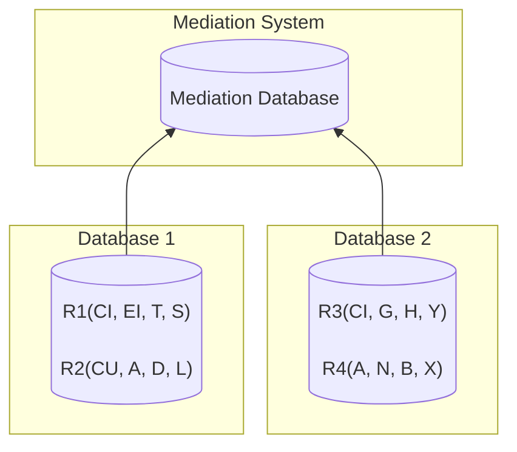

# Projet de Qualité de données : ETL-DQ

## Choix de l'ETL
**ETL** choisit : _Airflow_. 

## MS - Schéma cible

```mermaid
flowchart BT
    subgraph MS["Mediation System"]
        MSDB[("Mediation Database")]
    end

    subgraph DB1["Database 1"]
        RDB1[("R1(CI, EI, T, S)<br><br>R2(CU, A, D, L)")]
    end

    subgraph DB2["Database 2"]
        RDB2[("R3(CI, G, H, Y)<br><br>R4(A, N, B, X)")]
    end

    RDB1 --> MSDB
    RDB2 --> MSDB
```

