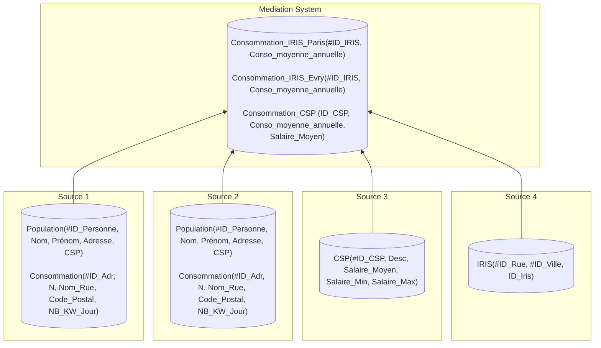

# Projet de Qualité de données : ETL-DQ

## Choix de l'ETL
**ETL** choisit : _Airflow_. 

## MS - Schéma cible

### Schéma 


### Requêtes

- **Consommation_IRIS_Paris** (Source1 &#10781; Source4) :
```SQL
INSERT INTO Consommation_IRIS_Paris(ID_IRIS, Conso_moyenne_annuelle)
SELECT 
    i.ID_Iris,
    AVG(c.NB_KW_Jour * 365) AS Conso_moyenne_annuelle
FROM Source1.Consommation c
JOIN Source4.IRIS i
    ON c.Nom_Rue    = i.ID_Rue
   AND c.Code_Postal = i.ID_Ville
GROUP BY i.ID_Iris;
```

- **Consommation_IRIS_Evry** (Source2 &#10781; Source4) :
```SQL
INSERT INTO Consommation_IRIS_Evry (ID_IRIS, Conso_moyenne_annuelle)
SELECT 
    i.ID_Iris,
    AVG(c.NB_KW_Jour * 365) AS Conso_moyenne_annuelle
FROM Source2.Consommation c
JOIN Source4.IRIS i
    ON c.Nom_Rue    = i.ID_Rue
   AND c.Code_Postal = i.ID_Ville
GROUP BY i.ID_Iris;
```

- **Consommation_CSP** (Source1 &#10781; Source2 &#10781; Source3) :
```SQL
INSERT INTO Consommation_CSP (ID_CSP, Conso_moyenne_annuelle, Salaire_Moyen)
SELECT
    csp.ID_CSP,
    AVG(conso.NB_KW_Jour * 365) AS Conso_moyenne_annuelle,
    csp.Salaire_Moyen
FROM Source3.CSP csp
LEFT JOIN (
    -- Consommations individuelles, Paris (Source 1)
    SELECT p.CSP, c.NB_KW_Jour
    FROM Source1.Population p
    JOIN Source1.Consommation c ON p.Adresse = c.ID_Adr

    UNION ALL

    -- Consommations individuelles, Evry (Source 2)
    SELECT p.CSP, c.NB_KW_Jour
    FROM Source2.Population p
    JOIN Source2.Consommation c ON p.Adresse = c.ID_Adr
) AS conso ON conso.CSP = csp.ID_CSP
GROUP BY csp.ID_CSP, csp.Salaire_Moyen;
```
