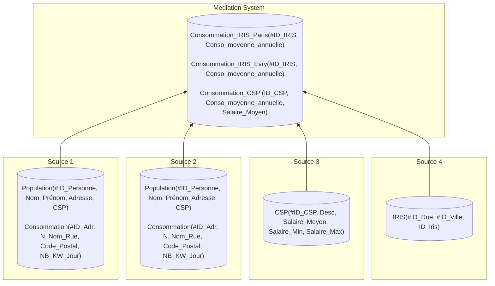

# Projet de Qualité de données : ETL-DQ

## Choix de l'ETL

**ETL** choisit : _Airflow_.

## MS - Schéma cible

### Schéma



### Requêtes

- **Consommation_IRIS_Paris** (Source1 &#10781; Source4) :

```SQL
INSERT INTO Consommation_IRIS_Paris(ID_IRIS, Conso_moyenne_annuelle)
SELECT 
    i.ID_Iris,
    AVG(c.NB_KW_Jour * 365) AS Conso_moyenne_annuelle
FROM Source1.Consommation c
JOIN Source4.IRIS i
    ON c.Nom_Rue    = i.ID_Rue
   AND c.Code_Postal = i.ID_Ville
GROUP BY i.ID_Iris;
```

- **Consommation_IRIS_Evry** (Source2 &#10781; Source4) :

```SQL
INSERT INTO Consommation_IRIS_Evry (ID_IRIS, Conso_moyenne_annuelle)
SELECT 
    i.ID_Iris,
    AVG(c.NB_KW_Jour * 365) AS Conso_moyenne_annuelle
FROM Source2.Consommation c
JOIN Source4.IRIS i
    ON c.Nom_Rue    = i.ID_Rue
   AND c.Code_Postal = i.ID_Ville
GROUP BY i.ID_Iris;
```

- **Consommation_CSP** (Source1 &#10781; Source2 &#10781; Source3) :

```SQL
INSERT INTO Consommation_CSP (ID_CSP, Conso_moyenne_annuelle, Salaire_Moyen)
SELECT
    csp.ID_CSP,
    AVG(conso.NB_KW_Jour * 365) AS Conso_moyenne_annuelle,
    csp.Salaire_Moyen
FROM Source3.CSP csp
LEFT JOIN (
    -- Consommations individuelles, Paris (Source 1)
    SELECT p.CSP, c.NB_KW_Jour
    FROM Source1.Population p
    JOIN Source1.Consommation c ON p.Adresse = c.ID_Adr

    UNION ALL

    -- Consommations individuelles, Evry (Source 2)
    SELECT p.CSP, c.NB_KW_Jour
    FROM Source2.Population p
    JOIN Source2.Consommation c ON p.Adresse = c.ID_Adr
) AS conso ON conso.CSP = csp.ID_CSP
GROUP BY csp.ID_CSP, csp.Salaire_Moyen;
```

## Qualité de données

### Facettes & Métriques :

#### Conformité

La **Conformité** mesure la validité du format des données.

Métriques :

- Format des chaînes de caractères :
  
  Évaluation de REGEX pour vérifier le format des données suivantes :
    - `Source1.Population.Adresse`
    - `Source2.Population.Adresse`
    - `Source1.Consommation.ID_Adr`
    - `Source2.Consommation.ID_Adr`
    - `Source1.Consommation.Nom_Rue`
    - `Source2.Consommation.Nom_Rue`
    - `Source4.IRIS.ID_Rue`

    Exemple : `Source1.Population.Adresse` = '12' est invalide.

- Ensemble fini de données (labels) :

  Évaluation de l'appartenance de l'ensemble des données _X_ à un ensemble prédéfinis de labels _Y_ :
    - `Source1.Population.CSP`
    - `Source2.Population.CSP`
    - `Source3.CSP.ID_CSP`
    - `Source1.Population.Code_Postal`
    - `Source2.Population.Code_Postal`
    - `Source4.IRIS.ID_Ville`

    Exemple : `Source1.Population.CSP` doit appartenir à l'ensemble des `ID_CSP` définis dans `Source3.CSP`, sinon la donnée serait invalide.

#### Hétérogénéité des échelles

L'**Hétérogénéité des échelles** mesure la dissimilarité des unités/échelles entre des données modélisant la même chose.

Métriques :

- Validité statistique extra ensembliste :

  Évaluation de la cohérence statistique des données (extremum, moyenne, médiane, écart type, etc.) entre deux ensembles _X_ et _Y_ :
    - (`Source1.Consommation.NB_KW_Jour`, `Source2.Consommation.NB_KW_Jour`)
- Validité statistique intra ensembliste :

  Évaluation de la cohérence statistique des données (extremum, moyenne, médiane, écart type, etc.) entre les différentes dimensions _D_ d'un même ensemble de données _X_ :
    - _D_ = {Salaire_moyen, Salaire_Min, Salaire_Max} pour _X_ = `Source3.CSP` (groupé selon `ID_CSP`)

#### Complétude des données

La **Complétude** mesure la quantité de données manquantes d'une base de données.

Métriques :

- Mesure du pourcentage de valeurs manquantes :
  - `Source4.IRIS.ID_Iris`
  - `Source1.Consommation.NB_KW_Jour`
  - `Source2.Consommation.NB_KW_Jour`
  - `Source1.Population.CSP`
  - `Source2.Population.CSP`
  - `Source3.CSP.Salaire_Moyen`

    Exemple : Par exemple, sur 10 000 lignes de `Source1.Consommation`, si 200 ont `NB_KW_Jour` manquant alors le taux de complétude est de 98%.
> [!CAUTION]
> **TODO** : Ajouter les attributs non clé utilisés pour faire les jointures entre sources (pour former les tables de _MS_)
>

#### Unicité

L'**Unicité** mesure la redondance d'une base de données.

- Doublons extra sources :

  Détection de doublons générés par la jointure de deux sources :
  - &forall; _x_ &#8712; (`Source1.Population` &#8746; `Source2.Population`), _x_ est unique. (L'inverse pourrait être observable si quelqu'un déménage).
  

- Doublons intra sources :

  Détection de doublons partiel (à partir d'un sous ensemble d'attributs) :
    - `Source1.Population.(Nom, Prénom)`
    - `Source2.Population.(Nom, Prénom)`
    - `Source1.Consommation.(N, Nom_Rue, Code_Postal)`
    - `Source2.Consommation.(N, Nom_Rue, Code_Postal)`
    - `Source3.CSP.Salaire_Moyen`
    - `Source3.CSP.(Salaire_Min, Salaire_Max)`
    - `Source4.IRIS.ID_Iris`

<<<<<<< HEAD
    Exemple : Dans `Source.Consommation`, si deux lignes partagent le même `(N, Nom_Rue, Code_Postal)` avec des `NB_KW_Jour` différents : doublon.

    → Hypothèse: Une adresse représente un et un seul logement.
=======
#### Cohérence

La **Cohérence** mesure la validité des relations entre les données.

- Distribution groupée des colonnes :

	L'intuition est la suivante : on analyse la distribution des données de toutes les colonnes, lorsque celles-ci sont groupées selon une autre colonne de la même relation _R_.

	Algorithme ***FilterRel*** :
    ```python
    def FilterRel(R: Relation) -> Relation:
        pk_cols = SELECT column_name
                FROM R.get_columns()
                WHERE (
                    SELECT COUNT(DISTINCT column_name)
                    FROM R
                ) = (
                    SELECT COUNT(column_name)
                    FROM R
                );
        # We exclude the `pk_cols` using difference between sets
        target_cols = R.get_columns() \ pk_cols
        return SELECT target_cols FROM R;
    ```

	**SIMILARITY & DISTANCE**

	Algorithme ***ComputeDissimilarityMatrix*** :
    ```python
    def ComputeDissimilarityMatrix(labels: list[str]) -> list[list[float]]:
        N = labels.len()
        D = numpy.zeros((N, N)) # Init a matrix N x N filled with zeros

        for idx_row in range(0, N-1):
            for idx_col in range(i+1, N-1):
                # We compute the distance using Levenshtein edit distance
                distance ← distance_levenshtein(labels[idx_row], labels[idx_col])
                word_len = max(labels[i].len(), labels[j].len())
                distance_normalized = distance / word_len if word_len > 0 else 0.0

                D[i][j] ← distance_normalized
                D[j][i] ← distance_normalized # symetric matrix
        return D
    ```

	Algorithme ***MultimodalDistance*** :
  	```python
  	def MultimodalDistance(a: Any, b: Any) -> float:
  	    if isinstance(a, numpy.ndarray) and isinstance(b, numpy.ndarray):
  	        return numpyp.linalg.norm(a - b)
  	    return abs(a - b)
  	```

	**ENCODING**

	Algorithme ***EncodeProjRel*** :
    ```python
    def EncodeProjRel(R: Relation) -> Relation:
        str_cols = SELECT column_name
                FROM R.get_columns()
                WHERE column_type LIKE 'varchar%';

        # We encode string columns as 2D float array
        for col_name in str_cols:
            labels = SELECT DISTINCT col_name FROM R;

    	    # We compute the dissimilarity matrix
    	    D = ComputeDissimilarityMatrix(labels)

            # Finally we encode the labels (generate embeddings) using t-SNE algorithm
            tsne = sklearn.manifold.TSNE(
                n_components=2, perplexity=int(labels.len()*0.5),
                metric="precomputed", init="random", random_state=42,
            )
            embeddings = tsne.fit_transform(D)
	
    	    # /!\ WARNING : After this operation R isn't anymore in 1FN
    	    R.set_column(col_name, embeddings)

    	return R
    ```

	Algorithme ***EncodeNumRel*** :
    ```python
    def EncodeNumRel(R: Relation) -> Relation:
        bool_cols = SELECT column_name
                    FROM R.get_columns()
                    WHERE column_type = 'boolean';
        
        for col_name in bool_cols:
            values = SELECT
                        CASE WHEN col_name = true THEN 1
                        ELSE 0 END AS col_name
                     FROM R;
            R.set_column(col_name, values)

        date_cols = SELECT column_name
                    FROM R.get_columns()
                    WHERE column_type = 'date';

        for col_name in bool_cols:
            values = SELECT CAST(col_name, INTEGER) AS col_name
                     FROM R;
            R.set_column(col_name, values)        
        return R
    ```
  
  **STATISTICS**

  Algorithme ***ComputeGroupStats*** :
  ```python
  def compute_group_stats(X_values) -> tuple[float, float]:
	"""Return : mean, variance"""
	if isinstance(X_values[0], numpy.ndarray):
		mu = np.mean(arr, axis=0)  # Centroïde [mean_x, mean_y]
        var = np.var(arr[:, 0]) + np.var(arr[:, 1])  # Variance spatiale
        return mu, var
	else:
		mu = numpy.mean(X_values)
        var = numpy.var(X_values)
        return mu, var 
  ```

  Algorithme ***AnalyzeGroupedDistribution*** :
    ```python
    def AnalyzeGroupedDistribution(R: Relation) -> ???:
        R_filtered = FilterRel(R)
        R_encoded = EncodeProjRel(EncodeNumRel(R_filtered))

		N = SELECT COUNT(*) FROM R_encoded;
		epsilon = 10e-12

        for x in R_encoded.get_columns():
            global_vals = SELECT x FROM R_encoded;
            global_mu, global_var = compute_group_stats(global_vals)

            for y in R_encoded.get_columns()\{x}:
                x_groups = SELECT x FROM R_encoded GROUP BY y;
				
				var_intra = 0.0
            	max_group_var = 0.0
            	M3 = 0.0

				for group in x_groups:
					Ng = group.len()
					group_mu, group_var = compute_group_stats(group)

					var_intra += (Ng / N) * group_var
					max_group_var = max(max_group_var, group_var)
					dist = MultimodalDistance(group_mu, global_mu)
					M3 = max(M3, sqrt(Ng) * dist)
				
				M1 = (global_var - var_intra) / (global_var + epsilon)
				M2 = max_group_var / (var_intra + epsilon)
				matrix_results[x][y] = [M1, M2, M3]
		
		return matrix_results
    ```

	> [!WARNING]
	> Problèmes ouverts :
	> - Comment gérer les valeurs `Null` ?!
	> - Comment déterminer le paramètre `perplexity` de l'algorithme _t-SNE_ à partir du nombre de rows ?
>>>>>>> 0a3878b (Add Cohérence metric in the Documentation)
