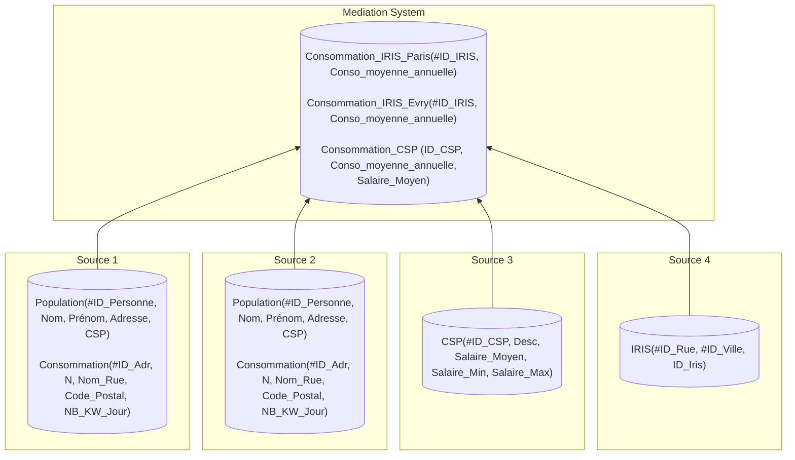

# Projet de Qualité de données : ETL-DQ

## Choix de l'ETL

**ETL** choisit : _Airflow_.

## MS - Schéma cible

### Schéma



### Requêtes

- **Consommation_IRIS_Paris** (Source1 &#10781; Source4) :

```SQL
INSERT INTO Consommation_IRIS_Paris(ID_IRIS, Conso_moyenne_annuelle)
SELECT 
    i.ID_Iris,
    AVG(c.NB_KW_Jour * 365) AS Conso_moyenne_annuelle
FROM Source1.Consommation c
JOIN Source4.IRIS i
    ON c.Nom_Rue    = i.ID_Rue
   AND c.Code_Postal = i.ID_Ville
GROUP BY i.ID_Iris;
```

- **Consommation_IRIS_Evry** (Source2 &#10781; Source4) :

```SQL
INSERT INTO Consommation_IRIS_Evry (ID_IRIS, Conso_moyenne_annuelle)
SELECT 
    i.ID_Iris,
    AVG(c.NB_KW_Jour * 365) AS Conso_moyenne_annuelle
FROM Source2.Consommation c
JOIN Source4.IRIS i
    ON c.Nom_Rue    = i.ID_Rue
   AND c.Code_Postal = i.ID_Ville
GROUP BY i.ID_Iris;
```

- **Consommation_CSP** (Source1 &#10781; Source2 &#10781; Source3) :

```SQL
INSERT INTO Consommation_CSP (ID_CSP, Conso_moyenne_annuelle, Salaire_Moyen)
SELECT
    csp.ID_CSP,
    AVG(conso.NB_KW_Jour * 365) AS Conso_moyenne_annuelle,
    csp.Salaire_Moyen
FROM Source3.CSP csp
LEFT JOIN (
    -- Consommations individuelles, Paris (Source 1)
    SELECT p.CSP, c.NB_KW_Jour
    FROM Source1.Population p
    JOIN Source1.Consommation c ON p.Adresse = c.ID_Adr

    UNION ALL

    -- Consommations individuelles, Evry (Source 2)
    SELECT p.CSP, c.NB_KW_Jour
    FROM Source2.Population p
    JOIN Source2.Consommation c ON p.Adresse = c.ID_Adr
) AS conso ON conso.CSP = csp.ID_CSP
GROUP BY csp.ID_CSP, csp.Salaire_Moyen;
```

## Qualité de données

### Facettes & Métriques :

#### Conformité

La **Conformité** mesure la validité du format des données.

Métriques :

- Format des chaînes de caractères :
  
  Évaluation de REGEX pour vérifier le format des données suivantes :
    - `Source1.Population.Adresse`
    - `Source2.Population.Adresse`
    - `Source1.Consommation.ID_Adr`
    - `Source2.Consommation.ID_Adr`
    - `Source1.Consommation.Nom_Rue`
    - `Source2.Consommation.Nom_Rue`
    - `Source4.IRIS.ID_Rue`
- Ensemble fini de données (labels) :

  Évaluation de l'appartenance de l'ensemble des données _X_ à un ensemble prédéfinis de labels _Y_ :
    - `Source1.Population.CSP`
    - `Source2.Population.CSP`
    - `Source3.CSP.ID_CSP`
    - `Source1.Population.Code_Postal`
    - `Source2.Population.Code_Postal`
    - `Source4.IRIS.ID_Ville`

#### Hétérogénéité des échelles

L'**Hétérogénéité des échelles** mesure la dissimilarité des unités/échelles entre des données modélisant la même chose.

Métriques :

- Validité statistique extra ensembliste :

  Évaluation de la cohérence statistique des données (extremum, moyenne, médiane, écart type, etc.) entre deux ensembles _X_ et _Y_ :
    - (`Source1.Consommation.NB_KW_Jour`, `Source2.Consommation.NB_KW_Jour`)
- Validité statistique intra ensembliste :

  Évaluation de la cohérence statistique des données (extremum, moyenne, médiane, écart type, etc.) entre les différentes dimensions _D_ d'un même ensemble de données _X_ :
    - _D_ = {Salaire_moyen, Salaire_Min, Salaire_Max} pour _X_ = `Source3.CSP` (groupé selon `ID_CSP`)

#### Complétude des données

La **Complétude** mesure la quantité de données manquantes d'une base de données.

Métriques :

- Mesure du pourcentage de valeurs manquantes :
  - `Source4.IRIS.ID_Iris`
  - `Source1.Consommation.NB_KW_Jour`
  - `Source2.Consommation.NB_KW_Jour`
  - `Source1.Population.CSP`
  - `Source2.Population.CSP`
  - `Source3.CSP.Salaire_Moyen`

> [!CAUTION]
> **TODO** : Ajouter les attributs non clé utilisés pour faire les jointures entre sources (pour former les tables de _MS_)
>

#### Unicité

L'**Unicité** mesure la redondance d'une base de données.

- Doublons extra sources :

  Détection de doublons générés par la jointure de deux sources :
  - &forall; _x_ dans (`Source1.Population` &#8746; `Source2.Population`), _x_ est unique. (L'inverse pourrait être observable si quelqu'un déménage).
- Doublons intra sources :

  Détection de doublons partiel (à partir d'un sous ensemble d'attributs) :
    - `Source1.Population.(Nom, Prénom)`
    - `Source2.Population.(Nom, Prénom)`
    - `Source1.Consommation.(N, Nom_Rue, Code_Postal)`
    - `Source2.Consommation.(N, Nom_Rue, Code_Postal)`
    - `Source3.CSP.Salaire_Moyen`
    - `Source3.CSP.(Salaire_Min, Salaire_Max)`
    - `Source4.IRIS.ID_Iris`
